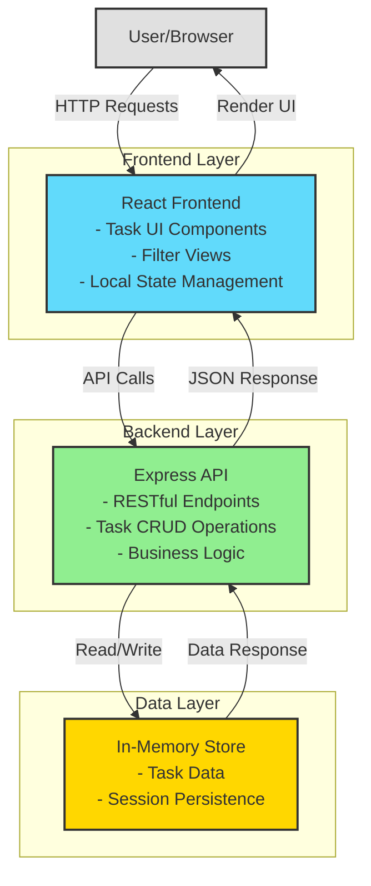

# Cloud Architecture Overview - TODO App

## System Context

The TODO app is a simple task management application built with a modern web stack. The architecture consists of three primary components that work together to provide a seamless user experience for managing tasks with due dates, priorities, and filtering capabilities.

## Component Description

### React Frontend
- **Purpose**: Provides the user interface for task management
- **Key Features**:
  - Task creation and editing forms
  - Task list display with due dates and priorities
  - Filter tabs (All, Today, Overdue)
  - Visual indicators for overdue tasks and priority levels
  - Responsive design for various screen sizes

### Express API
- **Purpose**: Handles business logic and data operations
- **Key Responsibilities**:
  - RESTful endpoints for task CRUD operations
  - Due date validation and overdue calculation
  - Task sorting logic (overdue → priority → due date)
  - Request validation and error handling
  - CORS configuration for frontend communication

### In-Memory Store
- **Purpose**: Provides temporary data persistence
- **Characteristics**:
  - Fast read/write operations
  - Session-based storage
  - No external database dependencies
  - Simple data structure for task objects
  - Data resets on server restart

## Data Flow

1. **User Interaction**: User interacts with the React frontend through the browser
2. **API Request**: Frontend sends HTTP requests to Express API endpoints
3. **Data Processing**: API processes requests and applies business logic
4. **Storage Operation**: API reads/writes task data to in-memory store
5. **Response**: API returns JSON response to frontend
6. **UI Update**: React updates the UI to reflect changes

## Technology Stack

- **Frontend**: React, CSS
- **Backend**: Node.js, Express.js
- **Storage**: In-memory JavaScript object
- **Communication**: RESTful HTTP/JSON

## Deployment Considerations

For the MVP phase, the application uses:
- Local development environment
- In-memory storage (data persists only during server runtime)
- No external dependencies or cloud services
- Simple deployment to local or development servers

### Future Enhancements (Post-MVP)
- Persistent database (e.g., PostgreSQL, MongoDB)
- Cloud deployment (e.g., AWS, Azure, Heroku)
- CDN for static assets
- Caching layer for improved performance
- Authentication and user management
